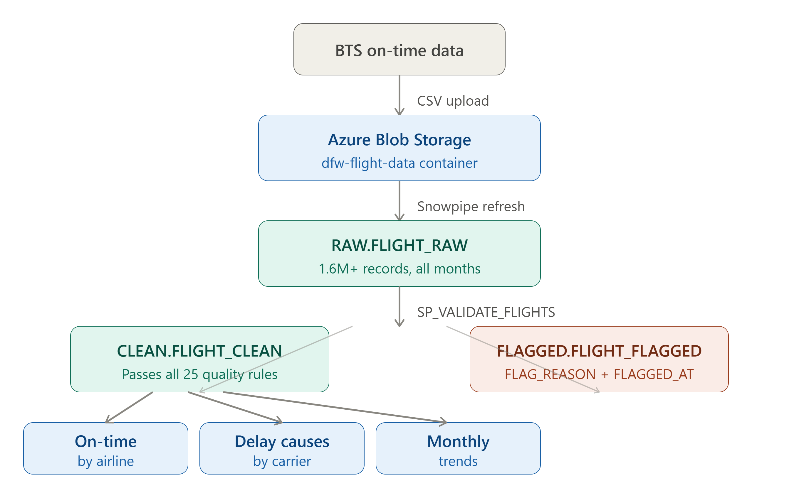

# Snowflake DFW Flight Data Quality Pipeline

A data quality pipeline built on Snowflake and Azure Blob Storage, using BTS On-Time Performance data for Dallas/Fort Worth International Airport (DFW).



## What it does

Raw BTS flight data CSV files are uploaded to Azure Blob Storage and ingested into Snowflake via Snowpipe. A stored procedure then validates every record against 25 quality rules, routing clean records to a CLEAN table and failures to a FLAGGED table with a specific rejection reason. Three aggregation views surface on-time performance, delay causes, and monthly trends for DFW flights.

Every record in RAW lands in exactly one downstream table — zero discrepancy guaranteed.

## Schema

```
DFW_FLIGHTS
├── RAW
│   ├── FLIGHT_RAW          -- landing table
│   ├── DFW_RAW_STAGE       -- external stage (Azure Blob)
│   ├── DFW_CSV_FORMAT      -- BTS CSV file format
│   ├── DFW_SNOWPIPE        -- automated ingestion
│   └── SP_VALIDATE_FLIGHTS -- data quality stored procedure
├── CLEAN
│   ├── FLIGHT_CLEAN        -- validated records
│   ├── V_ONTIME_BY_AIRLINE -- on-time performance by carrier
│   ├── V_DELAY_CAUSES      -- delay breakdown by cause
│   └── V_MONTHLY_TRENDS    -- monthly volume and performance
└── FLAGGED
    └── FLIGHT_FLAGGED      -- failed records with FLAG_REASON and FLAGGED_AT
```

## Running the pipeline

Upload a BTS CSV to your blob container, then:

```sql
ALTER PIPE DFW_FLIGHTS.RAW.DFW_SNOWPIPE REFRESH;
CALL DFW_FLIGHTS.RAW.SP_VALIDATE_FLIGHTS();
```

## Results

January–March 2024 — 1,658,267 records loaded:

| | Count |
|---|---|
| RAW | 1,658,267 |
| CLEAN | 1,658,257 |
| FLAGGED | 10 |
| DISCREPANCY | 0 |

## Data source

[BTS On-Time Reporting Carrier On-Time Performance](https://transtats.bts.gov/DL_SelectFields.aspx?gnoyr_VQ=FGJ&QO_fu146_anzr=b0-gvzr)

## Author

Vaughn Shideler — [etltalk.com](https://etltalk.com) — [linkedin.com/in/vshideler](https://linkedin.com/in/vshideler)
